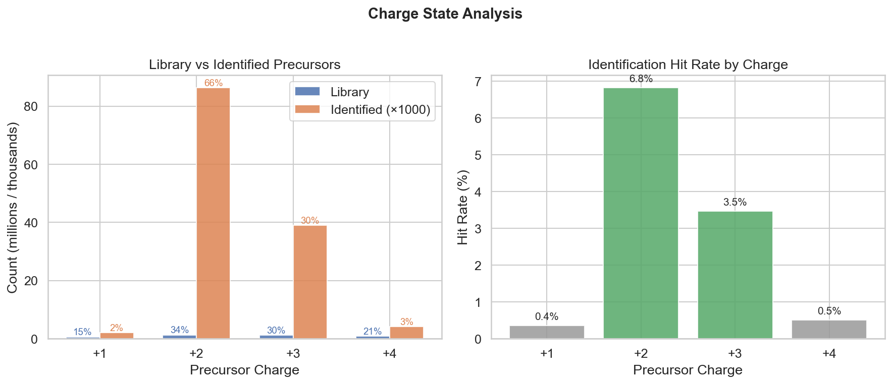
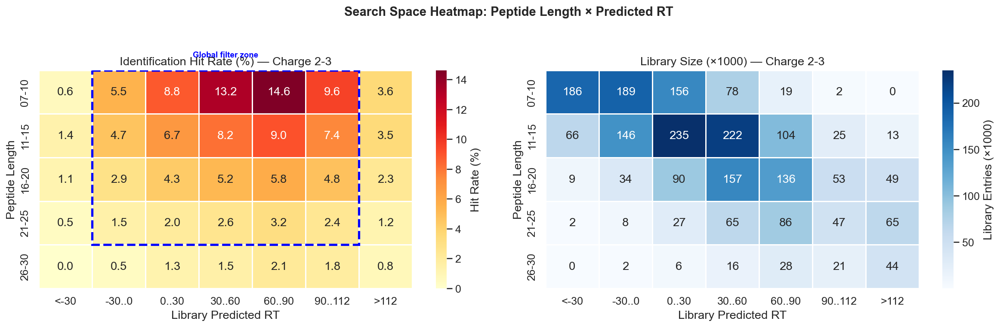
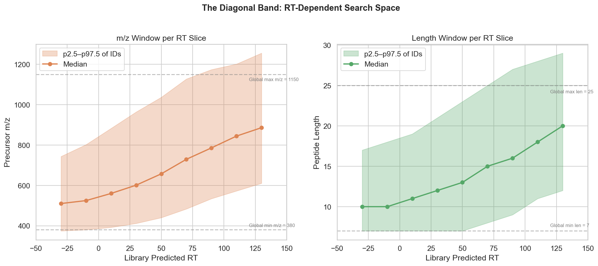
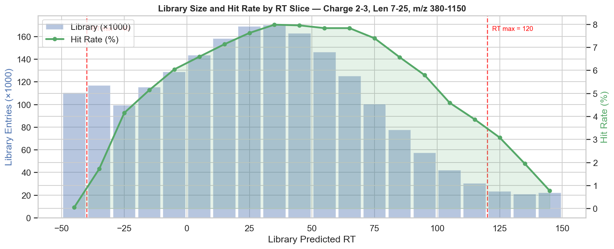
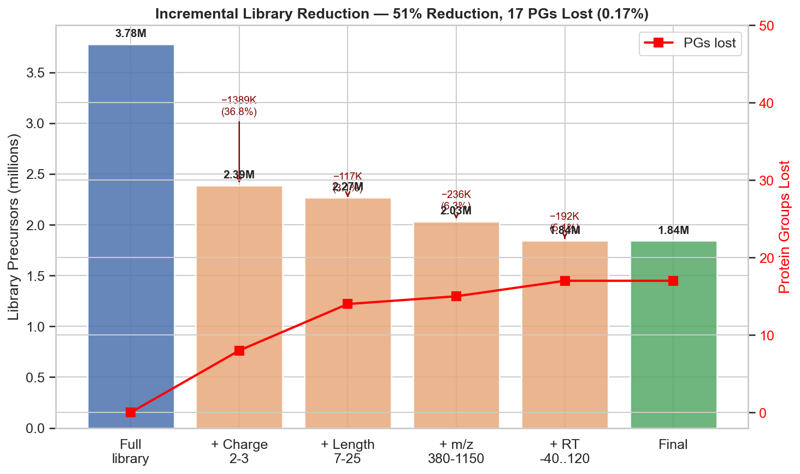
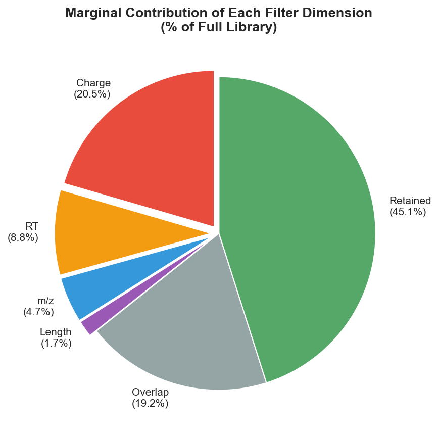
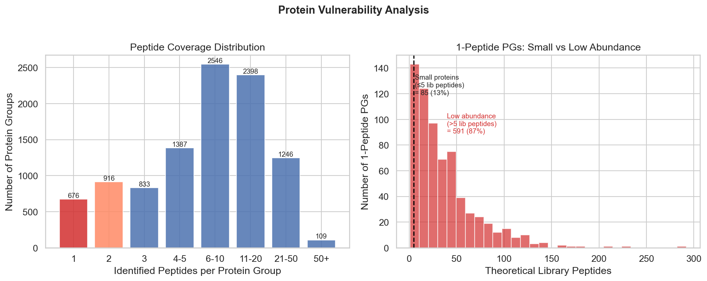

# Predicted Library Search Space Reduction Analysis

**Dataset:** ttht-biognosys tuned library, 6 LFQB runs
**Plot script:** [generate_plots.py](generate_plots.py)
**Library:** `lfqb_tuned_ttht-biognosys_tuned.predicted.parquet` (553 MB)
**Report:** `report.parquet` (85 MB), pre-filtered at 1% precursor FDR
**Date:** 2026-02-07

## 1. Overview

A predicted spectral library contains many precursors that will never be identified in a given experiment. These waste entries increase the search space, inflating the multiple testing burden and potentially reducing sensitivity. This analysis examines four dimensions of the library search space -- **charge state, peptide length, precursor m/z, and predicted RT** -- to quantify how much the library can be reduced while retaining protein group identifications.

| Metric | Value |
|--------|-------|
| Library precursors | 3,776,186 |
| Library unique peptides | 1,426,755 |
| Identified precursors (1% FDR) | 131,501 |
| Identified protein groups (1% PG FDR) | 10,134 |
| Overall precursor hit rate | 3.5% |

## 2. Charge State Analysis

Charge state filtering provides the single largest reduction in library size with negligible impact on protein group identifications.



| Charge | Library (%) | IDs (%) | Hit Rate | Exclusive PGs |
|--------|------------|---------|----------|---------------|
| +1 | 15.5% (584K) | 1.6% (2K) | 0.4% | **0** |
| **+2** | **33.5% (1.27M)** | **65.6% (86K)** | **6.8%** | - |
| **+3** | **29.7% (1.12M)** | **29.6% (39K)** | **3.5%** | - |
| +4 | 21.3% (804K) | 3.1% (4K) | 0.5% | 8 |

**Key finding:** Charge +1 occupies 15.5% of the library but contributes zero exclusive protein groups. Every protein identified via a +1 precursor is also identified via +2 or +3. Charge +4 has 8 exclusive PGs but a hit rate of only 0.5%.

**Recommendation:** Filter to charge 2-3. This removes 36.8% of the library (1.39M precursors) while losing only 8 protein groups (0.08%).

## 3. Search Space Heatmap: Peptide Length x Predicted RT

The productive search space is not uniformly distributed. Short peptides elute early (low predicted RT) while long peptides elute late, creating a characteristic diagonal band.



**Left panel:** Hit rates range from 0% (short peptides at very early RT, long peptides at very late RT) to 14.6% (short peptides at mid-late RT). The dashed blue rectangle marks the global filter zone.

**Right panel:** Library entry density. The largest blocks of entries are at short-to-medium lengths (11-15 aa) across all RT ranges, but many of these entries produce few identifications.

### RT Calibration

The library predicted RT has a linear relationship to observed chromatographic RT (r=0.993):

```
observed_RT = 0.268 * library_RT + 11.88
```

The chromatographic gradient (3.8-42 min) maps to library predicted RT **-30 to 112**. Using a relaxed window of **-40 to 120** provides safety margin while covering 99.8% of identified precursors.

## 4. The Diagonal Band: RT-Dependent Search Space

The productive m/z and peptide length ranges shift systematically with predicted RT. This forms a diagonal band in the multi-dimensional search space.



At early RT (< 0), the productive m/z window is narrow (380-800 Da, ~55% of global range) and peptides are short (7-18 aa, ~61% of global range). At late RT (> 80), the window shifts to higher m/z (530-1200 Da) and longer peptides (9-25+ aa).

### Per-RT-Slice Window Width (% of Global)

| RT Slice | m/z Width | Length Width |
|----------|----------|-------------|
| -40 to -20 | **48%** | **56%** |
| -20 to 0 | 55% | 61% |
| 0 to 20 | 64% | 67% |
| 20 to 40 | 72% | 78% |
| 40 to 60 | 78% | 89% |
| 60 to 80 | 84% | 94% |
| 80 to 100 | 83% | 100% |

**Practical benefit:** Applying RT-dependent windows (the "diagonal band") instead of global cutoffs gives ~3% additional library reduction (58% vs 55%) with 11 additional PGs lost. The largest savings come from early RT where both m/z and length can be strongly narrowed.

## 5. Hit Rate by RT Slice



The hit rate peaks at RT 30-50 (~8%) and is relatively flat across RT -10 to 70 (6-8%). Outside this range, the hit rate drops sharply. The red dashed lines mark the recommended RT filter boundaries (-40 and 120).

## 6. Incremental Filter Reduction

Each filter dimension was applied incrementally to measure its marginal contribution.



| Step | Library Size | Cumulative Reduction | PGs Lost |
|------|-------------|---------------------|----------|
| Full library | 3,776,186 | 0% | 0 |
| + Charge 2-3 | 2,387,561 | **36.8%** | 8 |
| + Length 7-25 | 2,270,201 | **39.9%** | 14 |
| + m/z 380-1150 | 2,033,741 | **46.1%** | 15 |
| + RT -40..120 | 1,842,123 | **51.2%** | 17 |

### Marginal Contribution of Each Dimension



| Dimension | Unique Removals | % of Library |
|-----------|----------------|-------------|
| Charge (keep 2-3) | 776K | **20.5%** |
| RT (keep -40..120) | 332K | **8.8%** |
| m/z (keep 380-1150) | 178K | **4.7%** |
| Length (keep 7-25) | 66K | **1.7%** |
| Overlap (multi-dimension) | 723K | 19.2% |

Charge filtering dominates. RT provides the second-largest unique contribution, removing entries that charge, length, and m/z filters cannot reach.

## 7. Protein Vulnerability Analysis

Proteins identified with only 1-3 peptides are the most vulnerable to library filtering, as losing their few identifying precursors means losing the protein entirely.



### 1-Peptide Proteins Are Low Abundance, Not Small

Of the 679 protein groups identified with a single peptide:
- Median **27 theoretical library peptides** (many tryptic peptides exist in the library)
- Only **13% are genuinely small** proteins (<=5 library peptides)
- **87% are low abundance** -- they have many theoretical peptides but are at the detection limit

### Filter Impact on 1-Peptide Proteins

After applying all filters (C2-3, L7-25, Mz380-1150, RT-40..120):
- **Zero** 1-peptide PGs have zero remaining library peptides
- Average **29 library peptides survive** per PG (78% of original)
- 72% retain **10+ library peptides** -- well covered

### What Causes Protein Loss?

Of the 17 PGs lost by the recommended filter (RT -40..120):

| Violation | PGs Lost | % |
|-----------|----------|---|
| RT boundary only | 10 | 59% |
| Charge only | 4 | 24% |
| Length only | 2 | 12% |
| m/z only | 1 | 6% |

15 of 17 lost PGs are 1-peptide proteins. RT is the riskiest dimension because many sit just outside the boundary (predicted RT values of -40.1, -39.9, 120.5, etc.).

### RT Boundary Sensitivity

| RT Window | Library Size | Reduction | PGs Lost |
|-----------|-------------|-----------|----------|
| -30 to 112 | 1,701,917 | 54.9% | 36 |
| **-40 to 120** | **1,842,123** | **51.2%** | **17** |
| -45 to 130 | 1,934,531 | 48.8% | 15 |

Widening the RT window from -30..112 to -40..120 recovers 19 PGs (all 1-peptide) at a cost of only 140K additional library entries (+3.7% of library). This is the recommended trade-off.

## 8. Summary and Recommendations

### Recommended Filter (This Dataset)

| Parameter | Value | DIA-NN Flag |
|-----------|-------|------------|
| Charge | 2-3 | `--min-pr-charge 2 --max-pr-charge 3` |
| Peptide length | 7-25 | `--min-pep-len 7 --max-pep-len 25` |
| Precursor m/z | 380-1150 | `--min-pr-mz 380 --max-pr-mz 1150` |
| Predicted RT | -40 to 120 | Post-hoc DuckDB filter |

**Result:** 3.78M to 1.84M precursors (**51% reduction**), losing 17 of 10,134 protein groups (**0.17%**).

### Implementation Options

1. **At library generation time** (preferred for charge, length, m/z): Set DIA-NN parameters directly. No library entries are created for excluded ranges.


2. **Post-hoc filtering** (required for RT): Use DuckDB to filter the predicted library parquet file on the `RT` column. This also enables RT-dependent adaptive windows.

3. **Diagonal band filtering** (advanced): Apply per-RT-slice m/z and length bounds for an additional ~3% reduction. Most beneficial at early RT where the productive search space is narrowest.

### What Needs Validation

- **Different gradients:** The RT window (-40..120) and the diagonal band shape will shift with different LC methods.
- **Different sample types:** Histone analysis or membrane protein studies may need charge 4+. Post-translational modification studies may need longer peptides.
- **Different instruments:** The m/z range should match the DIA acquisition window.
- **Sensitivity impact:** A smaller library reduces the multiple testing burden, which could actually **increase** identifications. This can only be confirmed by re-running DIA-NN with the filtered library.

### Q-Value Note

The report used in this analysis was pre-filtered at 1% precursor FDR (`--qvalue 0.01`). Protein group Q-values (`PG.Q.Value`) were additionally filtered at 1% for all protein-level analyses.
